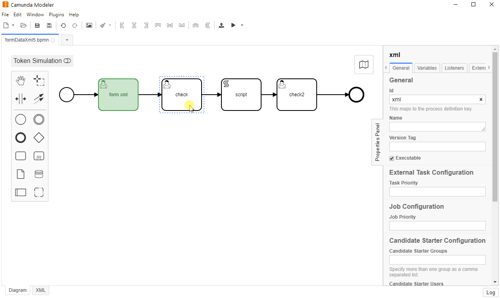

# Code editor for Camunda Modeler

[](https://github.com/camunda/camunda-modeler)

A [Camunda Modeler](https://github.com/camunda/camunda-modeler) plug-in based on the [plug-in example](https://github.com/camunda/camunda-modeler-plugin-example).

## About

This plug-in integrates a script editor to Camunda Modeler, allowing a user to write scripts with code highlights and language auto completion.

**Up to now, only if Script Format is 'groovy' or 'javascript'**



## Install

Extract the [release zip file](https://github.com/sharedchains/camunda-code-editor/releases/tag/v0.1.0) to your camunda-modeler/resources/plugins folder. Super easy!


## Development Setup

Use [npm](https://www.npmjs.com/), the [Node.js](https://nodejs.org/en/) package manager to download and install required dependencies:

```sh
npm install
```

To make the Camunda Modeler aware of your plug-in you must link the plug-in to the [Camunda Modeler plug-in directory](https://github.com/camunda/camunda-modeler/tree/develop/docs/plugins#plugging-into-the-camunda-modeler) via a symbolic link.
Available utilities to do that are [`mklink /d`](https://docs.microsoft.com/en-us/windows-server/administration/windows-commands/mklink) on Windows and [`ln -s`](https://linux.die.net/man/1/ln) on MacOS / Linux.

Re-start the app in order to recognize the newly linked plug-in.


## Building the Plug-in

You may spawn the development setup to watch source files and re-build the client plug-in on changes:

```sh
npm run dev
```

Given you've setup and linked your plug-in [as explained above](#development-setup), you should be able to reload the modeler to pick up plug-in changes. To do so, open the app's built in development toos via `F12`. Then, within the development tools press the reload shortcuts `CTRL + R` or `CMD + R` to reload the app.


To prepare the plug-in for release, executing all necessary steps, run:

```sh
npm run all
```

## Additional Resources

* [Codemirror editor ](https://codemirror.net/)
* [List of existing plug-ins](https://github.com/camunda/camunda-modeler-plugins)
* [Plug-ins documentation](https://github.com/camunda/camunda-modeler/tree/master/docs/plugins)


## Licence

MIT

This software includes [JS-Interpreter](https://github.com/NeilFraser/JS-Interpreter) based on Apache 2.0 license