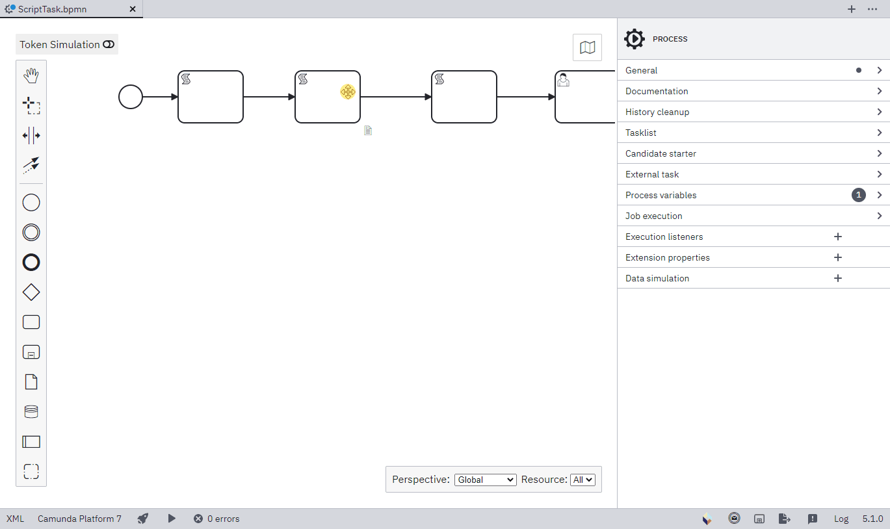

# Code editor for Camunda Modeler

[](https://github.com/camunda/camunda-modeler)

A [Camunda Modeler](https://github.com/camunda/camunda-modeler) plug-in based on the [plug-in example](https://github.com/camunda/camunda-modeler-plugin-example).

## About

This plug-in integrates a script editor to Camunda Modeler, allowing a user to write scripts with code highlights and language auto completion.

**Up to now, only if Script Format is 'groovy' or 'javascript'**



## Install

Extract the [release zip file](https://github.com/sharedchains/camunda-code-editor/releases/tag/v0.1.0) to your camunda-modeler/resources/plugins folder. Super easy!


## Development Setup

Unlike other plugins, this project has been wrapped in a [Maven](https://maven.apache.org/) project to integrate other components inside it and generate a final bundle which contains:
* The Camunda Modeler javascript plugin itself
* Our simple application which will get executed on Camunda Modeler startup
* A standalone JDK which executes the mentioned application

This solution was chosen to make it easier for a user to integrate the plugin to Camunda Modeler, avoiding to make him install JAVA on his own.

To work on this plugin you will need to install:

* [Node.js](https://nodejs.org/)
* [Java JDK](https://openjdk.java.net/)
* [Maven](https://maven.apache.org/)

## Building the Plug-in

Just run ```mvn clean install```. you will find the zip bundle in the target directory of the [build module](./build-module). 

## Additional Resources

* [Codemirror editor ](https://codemirror.net/)
* [List of existing plug-ins](https://github.com/camunda/camunda-modeler-plugins)
* [Plug-ins documentation](https://github.com/camunda/camunda-modeler/tree/master/docs/plugins)


## Licence

MIT

This software includes [JS-Interpreter](https://github.com/NeilFraser/JS-Interpreter) based on Apache 2.0 license